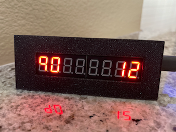

# JQ ESPHome Sensors & Devices

See [ESPHome](https://esphome.io/) for an introduction to ESPHome.

### 3D Printer Monitor
Monitors the status of multiple 3D printers by showing print progress on a MAX7219 display.

ESPHome Configuration: [print_progress_display.yaml](print_progress_display.yaml)

Parts:
  * [Enclosure STL](https://www.thingiverse.com/thing:2785082)
  * [Wemos D1 Mini](https://amzn.to/36ufILp)
  * [MAX7219 7 segment display](https://amzn.to/33dh37k)

